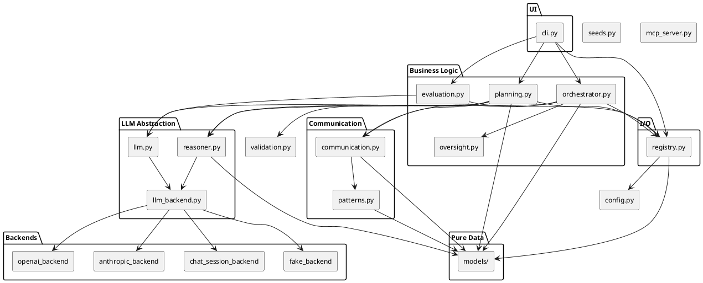

# Architecture

---

## Layered architecture

| Layer | Modules | Rule |
|-------|---------|------|
| **UI** | `cli.py` | Thin Click commands; no business logic |
| **Business logic** | `evaluation.py`, `planning.py`, `orchestrator.py`, `oversight.py` | Owns workflows; delegates I/O to registry, LLM to llm.py/reasoner.py |
| **Communication** | `communication.py`, `patterns.py` | Session creation and pattern dispatch; no direct I/O or LLM calls |
| **LLM abstraction** | `llm.py`, `reasoner.py`, `llm_backend.py` | All LLM calls flow through here |
| **I/O** | `registry.py` | Only module that reads/writes files |
| **Pure data** | `models/` | Dataclasses only — no I/O, no API calls |
| **Backends** | `backends/` | Provider implementations; register themselves |
| **Config** | `config.py` | Paths and env vars; no logic |
| **Seeds** | `seeds.py` | Default data definitions; no I/O |
| **Validation** | `validation.py` | Pure validation functions; no I/O or LLM |

---

## Component diagram



---

## Module ownership

| Module | Owns | Must NOT |
|--------|------|----------|
| `cli.py` | User-facing commands | Contain business logic |
| `evaluation.py` | Requirements quality gate, autofix | Create teams or plans |
| `planning.py` | CTO planning, HR team creation, project assembly | UI/CLI code |
| `orchestrator.py` | Execution loop, topo sort, checkpoints | Direct LLM calls |
| `oversight.py` | Human checkpoint terminal UI | File I/O beyond `registry.save_decision` |
| `validation.py` | Pure validation logic | I/O, LLM calls |
| `registry.py` | All YAML/JSON file reads and writes | Business logic |
| `llm.py` | Stateless LLM calls (evaluate, HR, autofix) | Session or pattern logic |
| `reasoner.py` | Prompt composition; Reasoner factory | Direct provider imports |
| `llm_backend.py` | Protocol definition, backend registry | Business logic |
| `backends/` | Provider implementations | Cross-provider imports |
| `communication.py` | Session creation, pattern dispatch | Direct LLM or file I/O |
| `patterns.py` | Communication pattern implementations | Direct LLM or file I/O |
| `models/` | Pure data structures | I/O, API calls, business logic |
| `seeds.py` | Default data definitions | I/O |
| `config.py` | Paths, env vars, constants | Logic |
| `mcp_server.py` | FastMCP server exposing workspace tools | Business logic |

---

## Dependency rules (what imports what)

```
cli.py
  ├─ evaluation, planning, orchestrator, registry, validation, seeds, models, config

evaluation.py
  ├─ llm, registry, models, config

planning.py
  ├─ llm, registry, communication, reasoner, validation, models, config

orchestrator.py
  ├─ registry, communication, reasoner, oversight, models, config

communication.py
  ├─ patterns, models, config

patterns.py
  ├─ models, config

reasoner.py
  ├─ llm_backend, models, config
  └─ (lazy) backends/chat_session_backend

llm.py
  ├─ llm_backend, config

llm_backend.py
  └─ (no aicompany imports — pure protocol + registry)

backends/*
  ├─ llm_backend (for register_backend)
  └─ models (chat_session_backend only)

registry.py
  ├─ models, config

models/
  └─ (no aicompany imports — only stdlib)
```

**Golden rule**: lower layers never import higher layers.  
`models` ← `registry` ← `llm/reasoner` ← `communication/patterns` ← `orchestrator/planning/evaluation` ← `cli`
