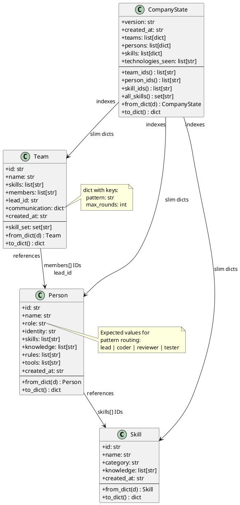
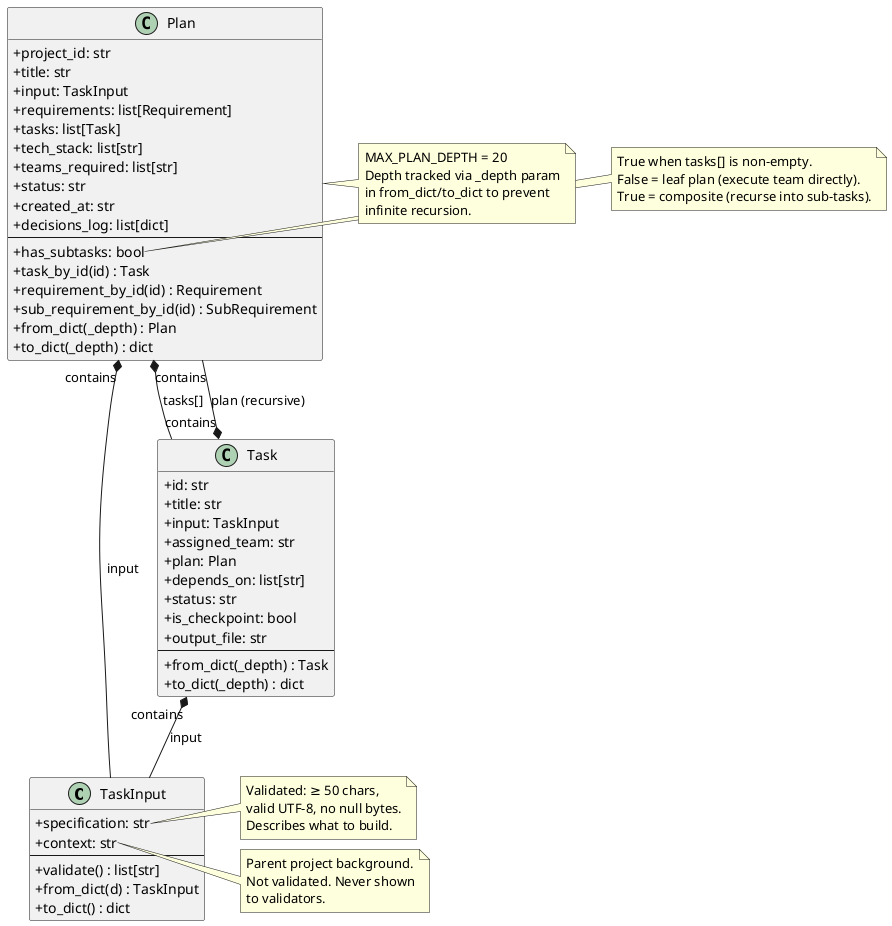
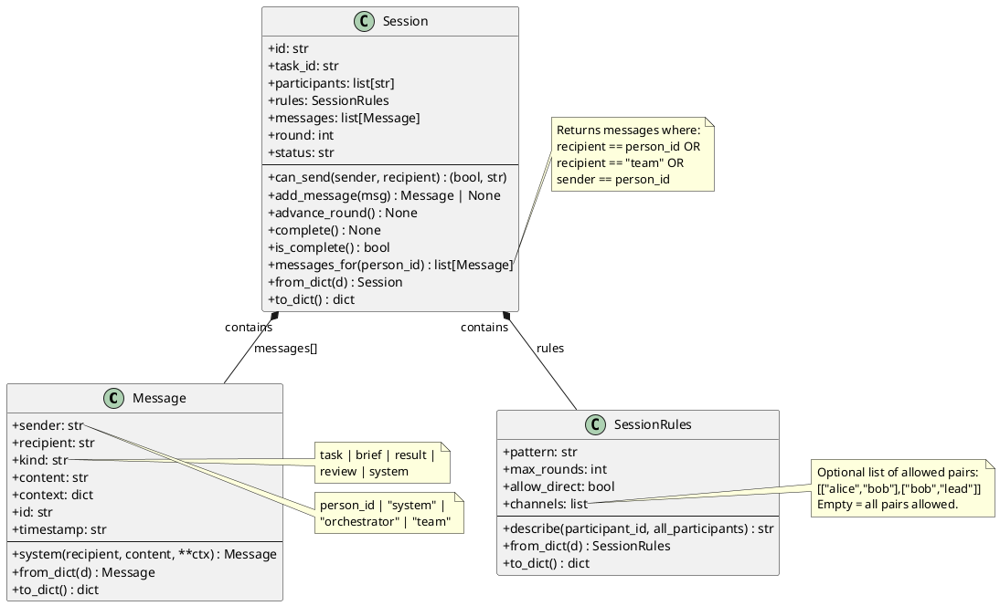
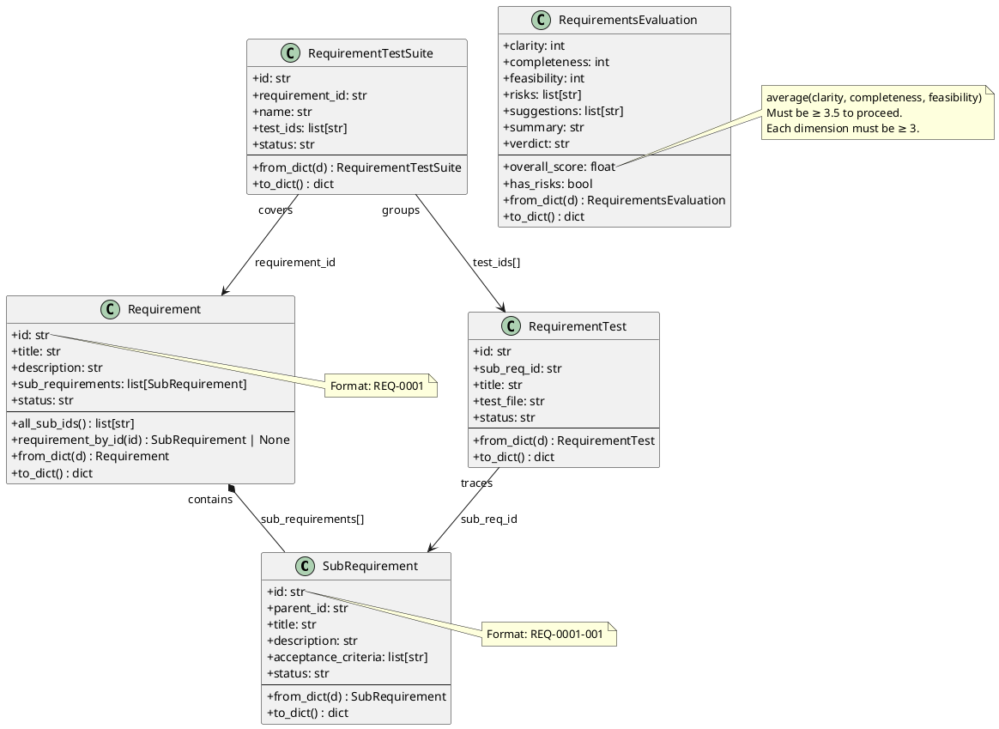

# Data Models

All models live in `aicompany/models/` and are pure dataclasses — no I/O, no LLM calls.
Every model implements `to_dict() / from_dict()` for YAML/JSON serialisation.

---

## 1. Organisation models (`models/org.py`)



**`build_prompt(person, skill_registry)`** (free function in org.py): Composes the system
prompt for an LLM call from `person.identity + skill.knowledge + person.knowledge + person.rules`.

---

## 2. Project models (`models/project.py`)



**Task status lifecycle**: `pending` → `running` → `done` | `failed`

---

## 3. Session models (`models/session.py`)



**`Session.can_send` rules** (all must pass):
1. Session is `"active"`
2. Round < `max_rounds`
3. Sender is a participant (or `"orchestrator"/"system"`)
4. Recipient is a participant (or `"team"/"orchestrator"/"system"`)
5. If `channels` defined: sender–recipient pair must be in `channels`

---

## 4. Requirements models (`models/requirements.py`)



---

## Disk layout

```
company/
  state.yaml               ← CompanyState (slim index of all entities)
  teams/<team_id>.yaml     ← Team
  persons/<person_id>.yaml ← Person
  skills/<skill_id>.yaml   ← Skill

projects/<project_id>/
  plan.yaml                ← Plan (with nested Tasks)
  requirements.md          ← raw requirements text
  req_tests/
    _requirements.yaml     ← list[Requirement]
    <req_test_id>.yaml     ← RequirementTest
  test_suites/
    <suite_id>.yaml        ← RequirementTestSuite
  outputs/<task_id>.md     ← agent output text
  sessions/<task_id>.json  ← Session (message log)
  decisions/<ts>_<t>.md    ← human decision records
```
