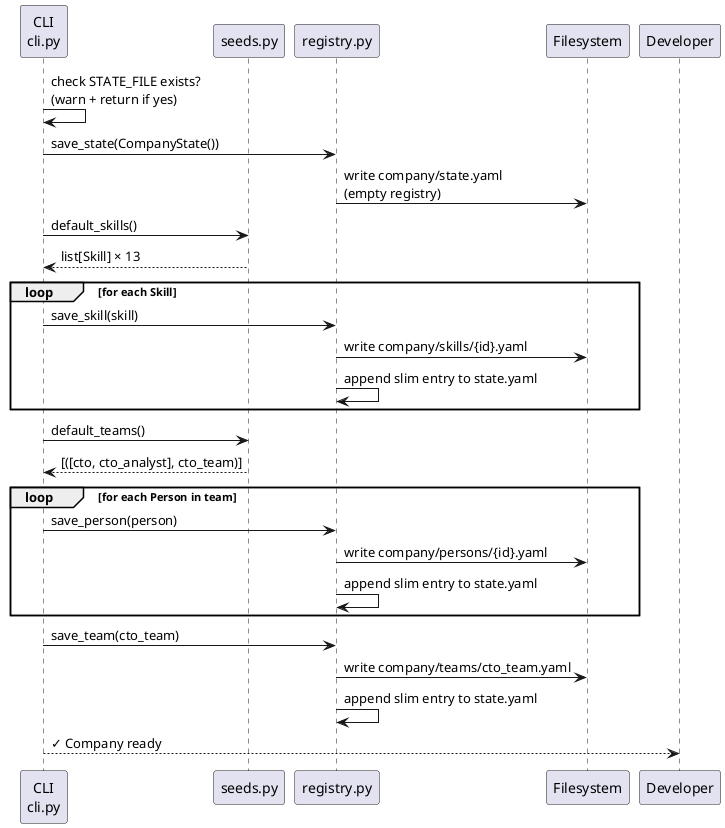

# Init flow

`./mycomp init` bootstraps the company — creates the state registry and seeds the starter
data set. It is idempotent: running it a second time prints a warning and exits without
overwriting anything.

---

## Sequence



---

## What gets created

**Skills** (13 shared skills, seeded from `seeds.default_skills()`):

| ID | Category |
|----|----------|
| python | language |
| typescript | language |
| html, css | language |
| fastapi | framework |
| sqlalchemy | framework |
| react, nextjs, tailwind | framework |
| postgresql, docker | tool |
| rest_api | practice |
| testing | practice |

**Teams** (1 team, seeded from `seeds.default_teams()`):

| Team | Members | Pattern |
|------|---------|---------|
| `cto_team` | `cto` (lead) + `cto_analyst` (reviewer) | `pair_review`, max_rounds=4 |

All development teams are created **on demand** by the HR agent during `new-project`.

---

## Key files after init

```
company/
  state.yaml              ← CompanyState registry
  skills/
    python.yaml
    fastapi.yaml
    ... (13 files total)
  teams/
    cto_team.yaml
  persons/
    cto.yaml
    cto_analyst.yaml
```

---

## Module responsibilities

| Step | Module | Function |
|------|--------|----------|
| Parse command | `cli.py` | `cmd_init()` |
| Default data | `seeds.py` | `default_skills()`, `default_teams()` |
| Persist all | `registry.py` | `save_state()`, `save_skill()`, `save_person()`, `save_team()` |
