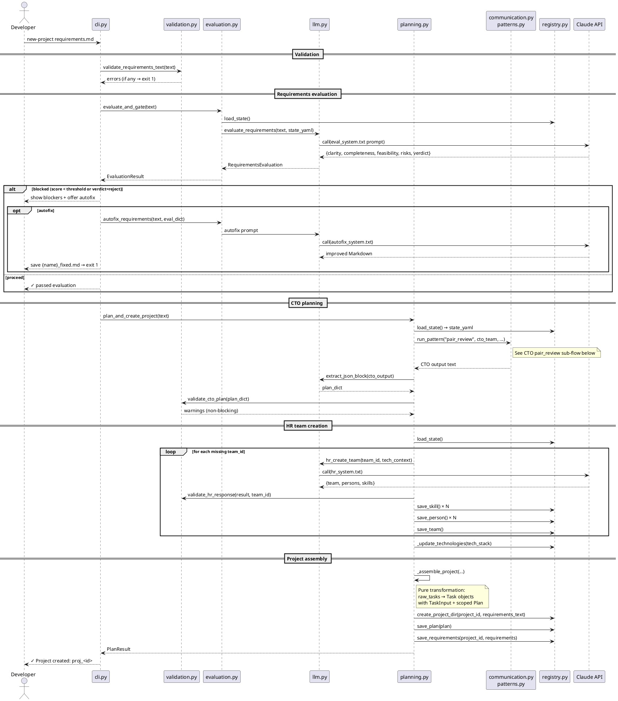
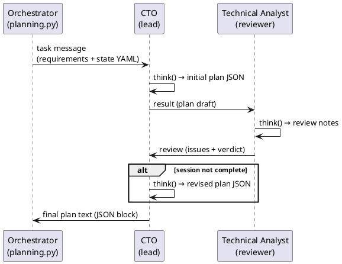
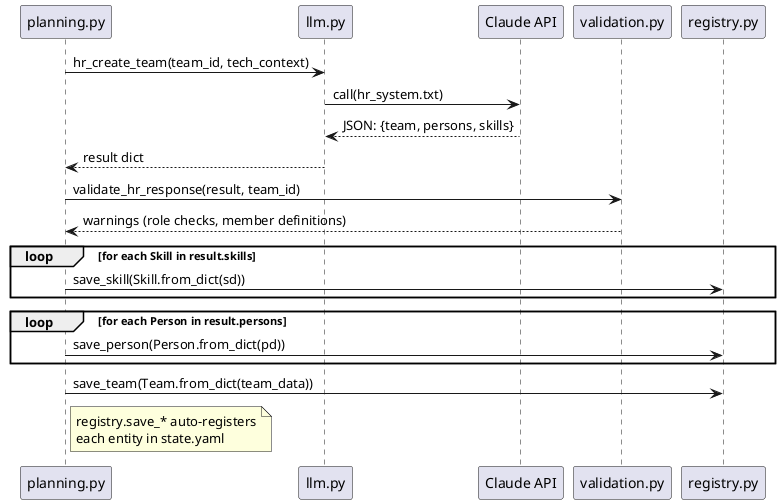

# New-project flow

`./mycomp new-project requirements.md` evaluates requirements, runs the CTO team to plan
the project, creates any missing teams via HR, and saves a ready-to-run project plan.

---

## Full sequence

---

## CTO pair_review sub-flow

The CTO team uses the `pair_review` pattern. Since the team has a lead (CTO) and reviewer
(analyst) but no dedicated coder, the **lead acts as producer** (see [08-communication.md](08-communication.md)):

CTO rules enforce: output ONLY a JSON block with the exact schema (title, tech_stack,
teams_required, requirements, tasks). The analyst returns a Markdown review with verdict
`approve` or `request-changes`. The CTO then revises if needed.

---

## HR team creation sub-flow

---

## Quality gate thresholds

| Check | Threshold | Location |
|-------|-----------|----------|
| Requirements minimum length | ≥ 50 chars | `validation.py` / `TaskInput.validate()` |
| Overall evaluation score | ≥ 3.5 / 5 | `config.MIN_SCORE_TO_PROCEED` |
| Each dimension (clarity/completeness/feasibility) | ≥ 3 / 5 | `config.MIN_DIMENSION_SCORE` |
| Verdict | must not be `"reject"` | `evaluation.py` |

---

## Outputs

| Artifact | Path | Created by |
|----------|------|------------|
| Project plan | `projects/<id>/plan.yaml` | `registry.save_plan` |
| Requirements | `projects/<id>/requirements.md` | `registry.create_project_dir` |
| Requirements YAML | `projects/<id>/req_tests/_requirements.yaml` | `registry.save_requirements` |
| New teams | `company/teams/<team>.yaml` | `registry.save_team` |
| New persons | `company/persons/<person>.yaml` | `registry.save_person` |
| New skills | `company/skills/<skill>.yaml` | `registry.save_skill` |
| Updated registry | `company/state.yaml` | auto on every save_* |
