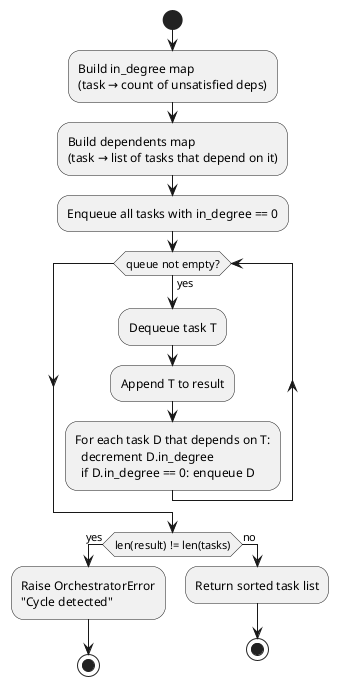
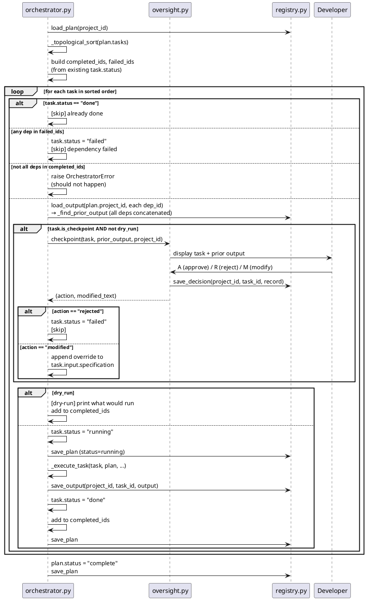
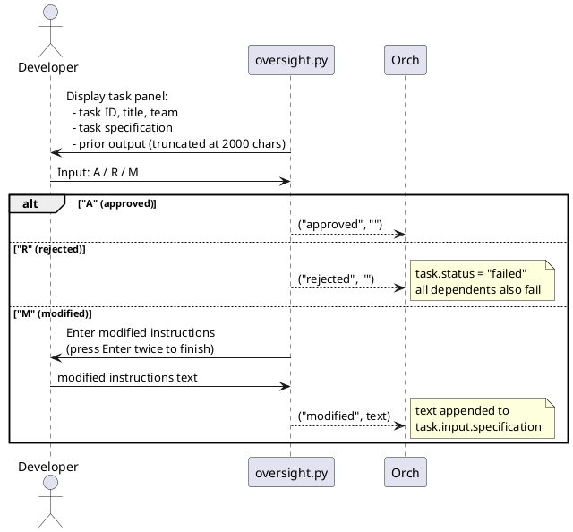
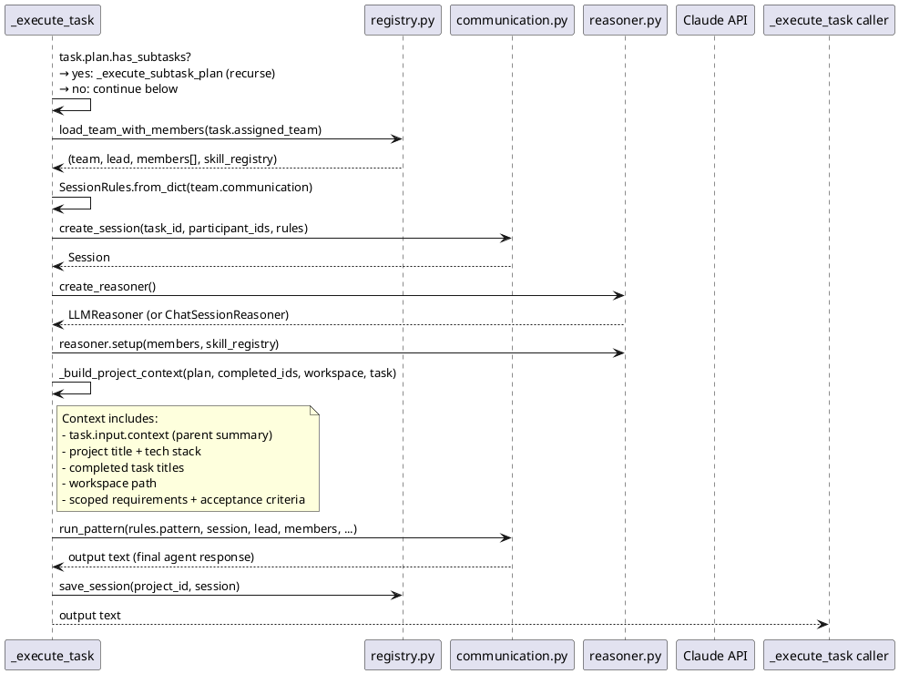

# Run flow

`./mycomp run <project-id>` loads the plan, sorts tasks by dependencies, and executes each
one — pausing at checkpoints for human approval. The loop is crash-safe: the plan is saved
after every task so a restart picks up where it left off.

---

## Topological sort (Kahn's algorithm)

Before any task runs, `_topological_sort(plan.tasks)` produces a dependency-safe execution
order:



Raises `OrchestratorError` on: unknown dependency IDs, dependency cycles.

---

## Main execution loop



---

## Checkpoint decision



---

## `_execute_task` call chain



---

## Nested sub-task execution

If `task.plan.has_subtasks == True`, `_execute_subtask_plan` is called instead of the
direct team call:

```
_execute_subtask_plan(sub_plan):
  sorted_subs = _topological_sort(sub_plan.tasks)
  for sub in sorted_subs:
    sub_output = _execute_task(sub, sub_plan, ...)
    registry.save_output(project_id, sub.id, sub_output)
    sub.status = "done"
  return "\n\n---\n\n".join(all_sub_outputs)
```

The aggregated output of all sub-tasks becomes the parent task's output.

---

## Crash-safe re-entry

The plan is saved after every task (`save_plan` called on every status change). On restart:

```
completed_ids = {t.id for t in plan.tasks if t.status == "done"}
failed_ids    = {t.id for t in plan.tasks if t.status == "failed"}
```

Tasks already `"done"` are skipped. Tasks whose dependencies failed are also skipped.
Execution resumes from the first unfinished, unblocked task.
