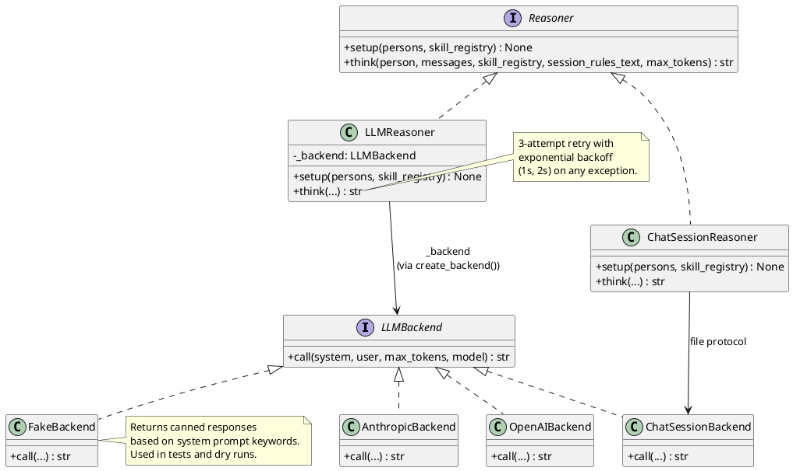
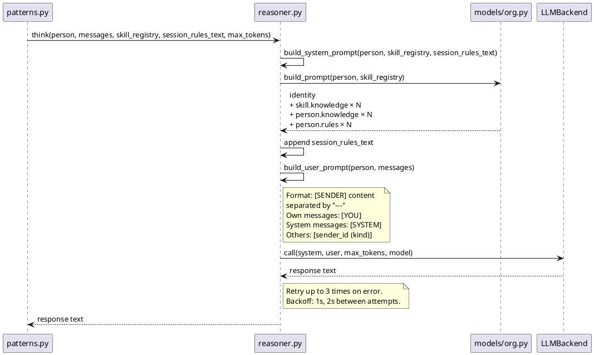

# LLM Layer

The LLM layer is split into three responsibilities:

| Layer | Module | Knows about |
|-------|--------|-------------|
| **Transport** | `llm_backend.py` + `backends/` | HTTP/API calls only. No persons, no messages. |
| **Agent brain** | `reasoner.py` | Persons, messages, prompt composition. Calls backend. |
| **Stateless calls** | `llm.py` | One-shot LLM calls for evaluation, HR, autofix. |

---

## Class hierarchy



---

## Backend selection

```
AICOMPANY_LLM_BACKEND = "anthropic"   # default
                        "openai"       # any OpenAI-compatible API
                        "fake"         # always available, no API key
                        "chat_session" # file-based human collaboration
```

`create_reasoner()` in `reasoner.py` returns `ChatSessionReasoner` when `LLM_BACKEND ==
"chat_session"`, otherwise `LLMReasoner`. All other backends are used through `LLMReasoner`.

---

## Prompt composition sequence



---

## Token budgets

| Call site | Budget | Config key |
|-----------|--------|------------|
| Team agent (`run_pattern`) | 8,096 | `MAX_TOKENS_TEAM` |
| CTO planning | 4,096 | `MAX_TOKENS_CTO` |
| HR team creation | 2,048 | `MAX_TOKENS_HR` |
| Requirements evaluation | 2,048 | `MAX_TOKENS_EVAL` |
| Requirements autofix | 4,096 | `MAX_TOKENS_AUTOFIX` |

---

## Stateless calls (`llm.py`)

These functions bypass the `Reasoner` and call the backend directly. Each loads a fixed
prompt from `aicompany/prompts/`:

| Function | Prompt file | Input | Output |
|----------|-------------|-------|--------|
| `evaluate_requirements(text, state_yaml)` | `eval_system.txt` | requirements + company YAML | `dict` (clarity, completeness, …) |
| `autofix_requirements(text, eval_dict)` | `autofix_system.txt` | original text + scores | improved Markdown string |
| `hr_create_team(skill_name, tech_context)` | `hr_system.txt` | team ID + tech context | `dict` (team, persons, skills) |

All three functions use `_call()` which includes the same 3-attempt retry as `LLMReasoner.think()`.

**`extract_json_block(text)`** parses the LLM response: tries ` ```json ``` ` fence first,
then bare ` ``` ``` `, then raw JSON. Raises `json.JSONDecodeError` if none match.

---

## Adding a new backend

1. Create `aicompany/backends/my_backend.py`
2. Implement `class MyBackend` with `call(system, user, max_tokens, model) -> str`
3. Call `register_backend("my_provider", MyBackend)` at module level
4. Import the module in `aicompany/backends/__init__.py` to trigger auto-registration
5. Set `AICOMPANY_LLM_BACKEND=my_provider`

No changes needed in any other module.
