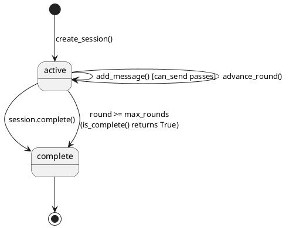
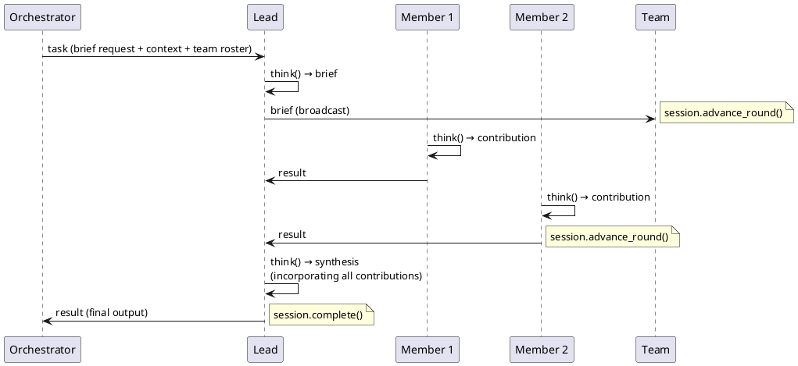
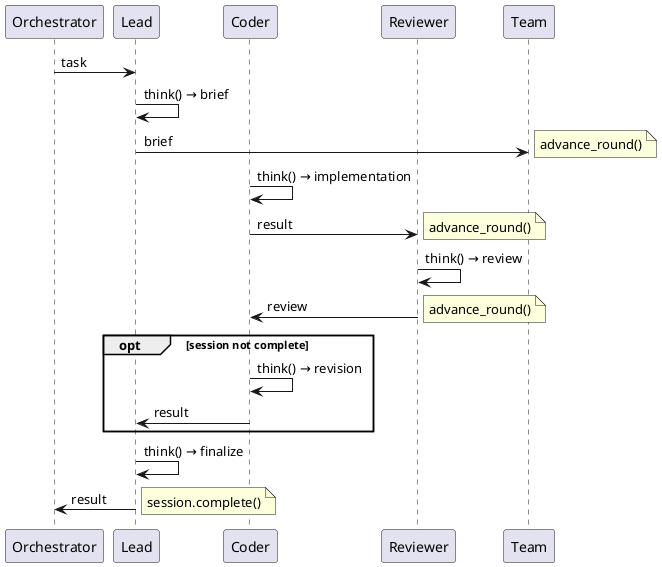
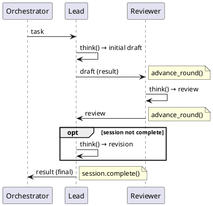
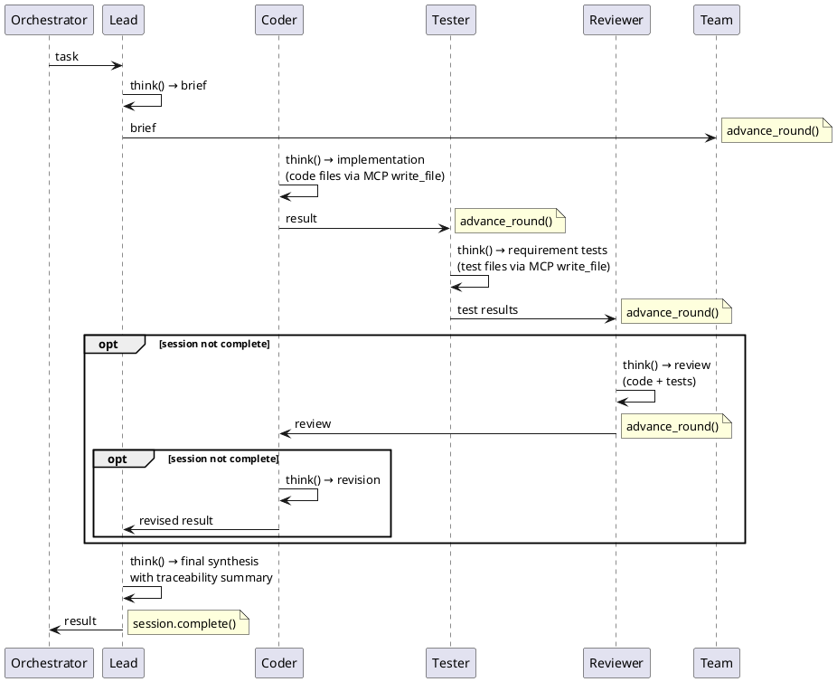

# Communication patterns

Agents collaborate through structured message sessions. `communication.py` creates sessions
and dispatches to a named pattern. `patterns.py` implements the actual message choreography.

---

## Session lifecycle



**`Session.can_send(sender, recipient)`** checks (all must pass):
1. `status == "active"`
2. `round < max_rounds`
3. `sender` is a participant or system actor
4. `recipient` is a participant or system actor
5. If `channels` defined: pair must be in channels list

**`Session.messages_for(person_id)`** returns messages where:
- `recipient == person_id` (addressed to this person), OR
- `recipient == "team"` (broadcast), OR
- `sender == person_id` (own messages, for context)

---

## Pattern selection

The team's `communication` dict (from YAML) → `SessionRules` → `rules.pattern`:

```
"lead_delegates"     → run_lead_delegates()
"pair_review"        → run_pair_review()
"develop_test_review"→ run_develop_test_review()
(unknown)            → falls back to run_lead_delegates()
```

---

## Pattern 1: `lead_delegates`

Default pattern. Works with any team size. Lead coordinates; members produce; lead synthesizes.



Special case: if team has only the lead (no other members), the brief IS the output — no
synthesis round.

---

## Pattern 2: `pair_review`

For teams with a reviewer. Used by CTO team and any HR-created team with a reviewer role.

**With coder + reviewer** (full pair_review):



**With reviewer but no coder** (lead-as-producer mode — used by CTO team):



**No reviewer** → falls back to `lead_delegates`.

---

## Pattern 3: `develop_test_review`

For teams with coder + tester + reviewer. Full TDD cycle with requirements traceability.



**Fallback chain**:
- No tester → `pair_review`
- No coder or reviewer → `lead_delegates`

---

## Workspace file writing

When `workspace` is set (non-empty), `_agent_rules()` appends file-writing instructions
to every person's session rules:

```
## File output
Workspace: `projects/<id>/src`
Write every implementation file using the write_file MCP tool.
Read existing files with read_file. Run tests/commands with run_command.
```

Agents call the MCP `write_file` tool from within their LLM response. Files appear in
`projects/<id>/src/` on the host filesystem.

---

## Adding a new pattern

1. Add `run_my_pattern(session, lead, members, ...) -> str` to `patterns.py`
2. Follow the same signature as the existing patterns
3. Add it to the `PATTERNS` dict at the bottom of `patterns.py`
4. Set `communication.pattern = "my_pattern"` in the team YAML
5. Add a test in `tests/test_communication.py`
