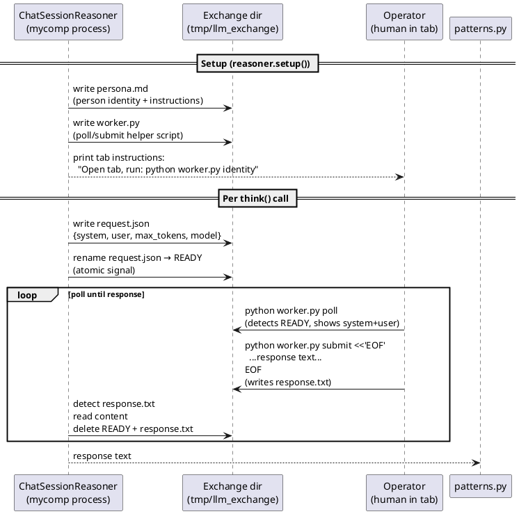

# MCP Server

The MCP (Model Context Protocol) server exposes file and shell tools to Claude agents
during task execution. Agents call these tools from within their LLM responses to read
and write files in the project workspace, run tests, and execute commands.

---

## Tools exposed

| Tool | Parameters | Returns | Purpose |
|------|-----------|---------|---------|
| `read_file(path)` | Relative path | File content (UTF-8) | Read any file in the project root |
| `write_file(path, content)` | Relative path + content | `"OK: wrote N chars"` | Write file, creating parent dirs |
| `list_directory(path)` | Relative path (default `.`) | Formatted listing | List files and subdirectories |
| `run_tests(pattern)` | Optional test name pattern | pytest output | Run test suite, optionally filtered |
| `run_command(command)` | Shell command string | stdout + stderr | Execute arbitrary command (60s timeout) |
| `get_project_status()` | — | Git status + recent commits | Current repo state |

**Path traversal protection**: All paths are resolved relative to `BASE_DIR` and checked to
remain within it. Paths outside the project root are rejected.

**Timeouts**: `run_tests` → 120s. `run_command` → 60s.

---

## Starting the server

```bash
./scripts/start_mcp.sh
# Starts FastMCP on port 8000 + Cloudflare tunnel → prints public URL

# Then set the env var before running:
export AICOMPANY_MCP_SERVERS='[{"type":"url","url":"https://<tunnel>.trycloudflare.com/mcp","name":"mycomp"}]'
./mycomp run <project-id>
```

The Anthropic backend uses `beta.messages.create()` with `betas=["mcp-client-2025-04-04"]`
when `AICOMPANY_MCP_SERVERS` is set.

---

## Transport modes

| Mode | How to start | Used for |
|------|-------------|---------|
| HTTP/SSE (default for remote) | `python -m aicompany.mcp_server --sse` | Production; Cloudflare tunnel |
| Specific port | `python -m aicompany.mcp_server --sse --port 9000` | Custom port |
| Stdio (local testing) | `python -m aicompany.mcp_server` | Direct stdio connection |

---

## ChatSession file protocol

When `AICOMPANY_LLM_BACKEND=chat_session`, agents are run by human operators in separate
terminal tabs. The `ChatSessionReasoner` communicates with each operator via the filesystem:



**Atomic protocol**: `request.json` is written first, then renamed to `READY`. Rename is
atomic on POSIX systems, preventing partial reads by the operator's polling script.

**Timeout**: Configurable via `MYCOMP_CHAT_TIMEOUT` env var (default 600 seconds).
